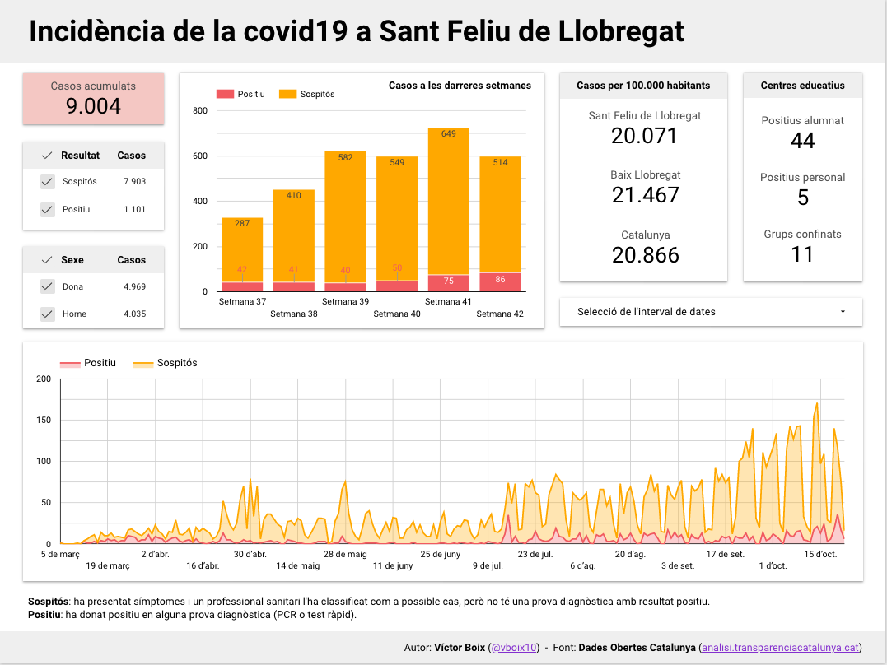

# Incidència de la covid19 a Sant Feliu de Llobregat

## Visualització

## Fonts de dades

* [Registre de casos de COVID-19 realitzats a Catalunya. Segregació per sexe i municipi](https://analisi.transparenciacatalunya.cat/Salut/Registre-de-casos-de-COVID-19-realitzats-a-Catalun/jj6z-iyrp)
* [Directori de centres docents TRAÇACOVID](https://analisi.transparenciacatalunya.cat/Educaci%C3%B3/Directori-de-centres-docents-TRA%C3%87ACOVID/3u9c-b74b)
* [Dades COVID-19 als centres educatius](https://analisi.transparenciacatalunya.cat/Educaci%C3%B3/Dades-COVID-19-als-centres-educatius/fk8v-uqfv)
